```{r echo=FALSE, message=FALSE}
library(dplyr)
library(kableExtra)
library(vembedr)
load("Data/operators.rdata")
```
# R Basics

Sources for this chapter:

* *R for Marketing Research ad Analytics, Second Edition* (2019). Chris Chapman and Elea McDonnell Feit
    * [http://r-marketing.r-forge.r-project.org/index.html](http://r-marketing.r-forge.r-project.org/index.html){target="_blank"}

## Introduction

### What is R?

* R **is** a programming language
* R **is not** a statistics program
    * Much different than SPSS, MiniTab, Stata, etc.
    * Does not use a point-and-click interface
    
### Why R?

* Emerging techniques usually available in R quickly
* Default educational platform for statistics programs (and spreading to other disciplines)
* Large and diverse set of analytic tools
* Powerful plotting options
* Large community of helpful users
* R skills are in high demand

And

* R is free

### Why NOT R?

* Steep learning curve
* Requires programming

### What is RStudio?

* RStudio IDE is an integrated development environment that makes working with R more user friendly
* Not required to use R, but provides a better interface and environment of writing code, editing code, and creating documents.
* Complete separate software

And

* RStudio is free


### Getting Started

#### Option 1: Install on your Machine
1. Install "R base" from the Comprehensive R Archive Network (CRAN)
    * [https://cran.r-project.org/](https://cran.r-project.org/){target="_blank"}
2. Install RStudio
    * [https://posit.co/download/rstudio-desktop/#download](https://posit.co/download/rstudio-desktop/#download){target="_blank"}

#### Option 2: Use BGSU's Virtual Computing Lab pilot

* See course website for link
    
#### Option 3: Use a computer in an on-campus computer lab

* All computer in on-campus computer labs should have R and RStudio installed

### Navigating RStudio

As you can see in Figure \@ref(fig:rstudiopane), RStudio is typically divided in 4 quadrants.

``` {r rstudiopane, echo=FALSE, fig.cap="RStudio Layout"}
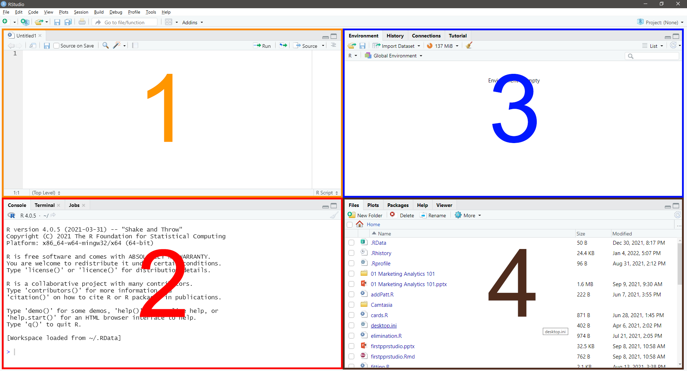
```

#### <span style="color: #ff9600;">Quadrant 1</span>

The upper-left corner is the **source** pane. This pane is where the majority of your programming or coding will take place.  When working in this pane, the code does not run unless you tell it to run.  In addition, the code can be saved to prevent work from being lost. 

#### <span style="color: #ff0000;">Quadrant 2</span>

The lower-left corner is the **console** pane.  While it contains several tabs, generally the `Console` tab is the only one used.  The console is where R actually evaluates the code.  If you run code from the a source pane window, the code will automatically be put into the console pane and evaluated.  You can also type code directly into the console pane and receive immediate results.  Depending on the code, the results will appear directly in the console or in a tab Quadrant 4. The ">" symbol shows that the console is ready for input.

#### <span style="color: #0018ff;">Quadrant 3</span>

The upper-right corner also contains several tabs, but the `Environment` and `History` tabs are the ones used most often.

* The `Environment` tab lists all data objects that have been defined in the current session.
* The `History` tab is an archive of all commands run in the current session.

#### <span style="color: #4f2c1d;">Quadrant 4</span>

The bottom-right corner also contains several tabs, all of which are used at different times.

* The `Files` tab lists all files in the current directory.
* The `Plots` tab shows visualizations created during the current session.
* The `Packages` tab shows all packages installed as well as which packages are currently loaded.
* The `Help` tab contains the help menu.
* The `Viewer` tab contains output from code if the code directs it to be displayed there.

\newpage
## R Language

### Basics of R Commands

* R is case sensitive
* When using the console, use the keyboard <span style="background-color: #f7f7f7;">&nbsp;&#8593;&nbsp;</span> and <span style="background-color: #f7f7f7;">&nbsp;&#8595;&nbsp;</span> arrow keys to easily cycle through previous commands typed.
* When using the text editor (i.e., a script file) in the source pane, use the `Ctrl`+`Enter` keyboard shortcut to submit a line of code directly to the console.
    * The entire line does **not** need to be highlighted; the cursor needs to be anywhere on the line to be submitted.
* When using the text editor/script file, the "#" symbol signifies a comment
    * Everything after is ignored
    * It can be on the same line:
    ```{r, eval=FALSE}
    x <- 100   # Assign 100 to x
    ```
    * It can be on separate lines:
    ```{r, eval=FALSE}
    # Assign 100 to x
    x <- 100
    ```

### Operators

Mathematical and logical operators are used frequently.
```{r roperators, echo=FALSE}
operators %>% 
   select(-Type) %>% 
   kbl(caption="R Operators") %>%
   pack_rows(index=c("Mathematical"=5, "Logical"= 10))
```

\newpage
## Packages

Packages are collections of functions that have been written to expand the functionality of R.  Packages are not automatically included, and if a command is given that is not part of a package installed and loaded, R will give an error message.  Therefore, the package must first be installed, and then loaded.

### Installing Packages

* Installing packages is performed with the `install.packages("")`function, where the name of the package is inside the quotation marks
* Two packages that used quite often in this course are `ggplot2` and `dplyr`
    ```{r, eval=FALSE}
    install.packages("ggplot2")
    install.packages("dplyr")
    ```
* **NOTE 1**: Packages only need to be installed on your machine once
* **NOTE 2**: If using BGSU's Virtual Computing Lab, new packages cannot be installed, but the version in the virtual environment has *most* of the most common packages pre-installed

### Loading Packages

* Once a package is installed, it has to be loaded with the `library()` function, where the name of the package is in the parentheses, in order to be used
    ```{r}
    library(ggplot2)
    library(dplyr)
    ```
* **NOTE 1**: It is not uncommon to see a variety of messages when loading a package
* **NOTE 2**: Packages need to be loaded every time you start a new R session

\newpage
## Getting Help

* R has built in help to assist with understanding different functions
* To access the help, type `? FUNCTION` in the console, and the help page for that function will show up in the lower-right pane under the help tab
    ```{r eval=FALSE}
    ? mean
    ```

\newpage
## Basic Object Types (and Other Important Stuff)

* Objects in R include variables, data sets, and functions
* The assignment operator `<-` assigns a value to a named object
    ```{r, comment=NA}
    x <- 100     # Assign value 100 to object 'x'
    x            # Display object 'x'
    ```
    **NOTE**: In RStudio console or script file, `Alt`+`-` will automatically paste the assignment operator
* As stated before, object names are case sensitive
    ```{r, comment=NA, error=TRUE}
    x <- 100     # Assign value 100 to object 'x'
    X            # Display object 'X'
    ```
* The `print` command can also be used to print objects
    ```{r comment=NA}
    print(x)
    ```

[Video Tutorial: Assignment Operator](https://youtu.be/y1Qx0bSaTa8){target="_blank"}

### Vectors

* Vectors can be created many ways and take many data types
* One method is to using the `c()` function, which concatenates individual items
    ```{r, comment=NA}
    x.Num <- c(1, 3.14, 5.49, 10, 20)
    x.Num
    x.Log <- c(TRUE, FALSE, TRUE, TRUE, FALSE)
    x.Log
    x.Char <- c("fr", "fr", "jr", "so", "sr")
    x.Char
    ```
* The class of the vector can be checked with the `class()` function
    ```{r, comment=NA}
    # Concatenate class functions and print together
    print(c(class(x.Num), class(x.Log), class(x.Char)))
    ```

[Video Tutorial: Vectors - Part 1](https://youtu.be/X6G7XpuwOjo){target="_blank"}

* Vectors can only hold a single class/type of value
    * When multiple classes are included, the values are coerced to the most general type
    ```{r}
    x.Mix <- c(1, FALSE, 3.5, "Hello!")
    x.Mix
    class(x.Mix)
    ```
* The `c()` function can be used to add to existing vectors, or combine vectors
    * Type coercion will be applied as needed
    ```{r}
    x2 <- c(x.Num, 25, 50)
    x.Num
    x2
    x3 <- c(x2, "Hello")
    x3
    ```
* Math can be applied directly to vectors
    ``` {r}
    x.Num
    x.Num + 100
    x.Num * pi
    ```
* The `length()` function provides the length of a vector
    ```{r}
    length(x.Num)
    length(x.Char)
    ```
* The `str()` function provide the structure of an object
    * Class, Length, and Value
    ```{r}
    str(x.Num)
    str(x.Char)
    ```

[Video Tutorial: Vectors - Part 2](https://youtu.be/iOTz3Yhe2FY){target="_blank"}

### Indexing

* Indexing is used to obtain particular elements of a data structure
* Vectors are indexed with square brackets, `[]`
    ```{r}
    # Obtain the third element of the 'x.Num' vector
    x.Num[3]
    ```
* Items can be excluded with negative indexing
    ```{r}
    # Obtain all elements except the third element of the 'x.Num' vector
    x.Num[-3]
    ```
* Indexing also works with logical operators
    ```{r}
    # Obtain all elements in 'x.Num' greater than 5
    x.Num[x.Num > 5]
    ```

[Video Tutorial: Indexing](https://youtu.be/1o5b7CZCCKU){target="_blank"}

### Sequencing

* Vectors can also be created using sequencing
* Integer sequencing is done with `#:#` coding
    ```{r}
    x.Seq <- 1:10
    x.Seq
    ```
* Sequences can also be used in indexing
    ```{r}
    # Obtain the second through fourth element of the 'x.Num' vector
    x.Num[2:4]
    ```
* Complex sequencing can be done using the `seq()` function
    ```{r}
    x.Seq2 <- seq(from=0, to=100, by=20)
    x.Seq2
    ```
    Note: the `from=`, `to=` and `by=` can be excluded
    ```{r}
    x.Seq3 <- seq(0,100,20)
    x.Seq3
    ```

[Video Tutorial: Sequencing](https://youtu.be/bYBTFuQVlg4){target="_blank"}

### Missing (and Other Interesting) Values

* In R, missing values are assigned a special constant, <span style="font-family: Courier;">NA</span>
* <span style="font-family: Courier;">NA</span> is not a character value, but a type of its own
* Any math performed on a value of <span style="font-family: Courier;">NA</span> becomes <span style="font-family: Courier;">NA</span>
    ``` {r}
    x.Scores <- c(85, 93, NA, NA)
    mean(x.Scores)
    ```
* Many commands contain a option, `na.rm=TRUE`, to ignore <span style="font-family: Courier;">NA</span> data when performing the function
    ```{r}
    mean(x.Scores, na.rm=TRUE)
    ```
* <span style="font-family: Courier;">NA</span> values can also be removed before performing the function using the `na.omit()` function
    ```{r}
    mean(na.omit(x.Scores))
    ```
* R also has special types for infinity, <span style="font-family: Courier;">Inf</span>, and undefined numbers (i.e., "not a number"), <span style="font-family: Courier;">NaN</span>
    * To see this in action, take the natural log, `log()`, of certain numbers
    ```{r}
    log(-1)
    log(0)
    ```
    Notice that R provides a warning when the <span style="font-family: Courier;">NaN</span> is found
    
### Factors

* Character data can be converted into nominal **factors** using the `as.factors()` function
* Each unique character value will be a level of the factor
    * Behind the scenes, R stores the values as integers, with a separate list of labels
* When the data type is set as a factor, R knows how to handle it appropriately in the model
* The levels can be accessed with the `levels()` function
    ```{r}
    x.Class <- as.factor(x.Char)
    str(x.Class)
    levels(x.Class)
    ```
    
\newpage
## Data Frames

Data frames are an object type that deserve special attention

### Overview

* Most common way to handle data sets in R
* Provide data to statistical functions
* Think of it like a spreadsheet, or a rectangular object where:
    * Columns are varying data types (i.e., variables)
    * Rows are values in each column (i.e, observations)

### Creating a data frame

* Can construct a data frame with the `data.frame()` function
    * Takes as input a set of vectors of the same length
    ```{r, cache=TRUE}
    x.df <- data.frame(x.Num, x.Log, x.Char)
    x.df
    ```
    * Note that the column names are inherited from the contributing vector
* Elements can be indexed using `[ROW, COLUMN]` notation
    ```{r, cache=TRUE}
    # Obtain the first element of the third row of data frame 'x.df'
    x.df[3,1]
    # Obtain the third element of the second row of data frame 'x.df'
    x.df[2,3]
    ```

[Video Tutorial: Data Frames (Part 1)](https://youtu.be/Dyo7KOltfKc){target="_blank"}

#### Using vectors in-line

* The vectors can be created in line (i.e., not already created)
* If the vectors are of different length, the shorter vector will be repeated **IF** the longest vector is divisible by the vector
* If a single value is provided instead of a vector, it is repeated for all rows
    ```{r, cache=TRUE}
    x2.df <- data.frame(var1=seq(10,100,10),
                        var2=c("Yes","No"),
                        var3=1:5,
                        var4=100)
    x2.df
    ```

[Video Tutorial: Data Frames (Part 2)](https://youtu.be/VnSLuKLWr3A){target="_blank"}

### Viewing a Data Frame

There are a few ways to view a data frame

1. Type the data frame name in the console
    ```{r}
    x.df
    ```
    * With data frames that have many variables, this is cumbersome
    * With data frames with many rows, a "max.print" setting will kick in and not all rows will be shown
2. To view only a few rows of data, the `head(DF, n)` function can be used, where <span style="font-family: Courier;">DF</span> is the name of the data frame, and <span style="font-family: Courier;">n</span> (optional) is the number of rows to view, with 10 as the default<br>
**NOTE**: The "Salaries" data frame from the `car` package is being used as an example
``` {r, echo=FALSE, message=FALSE}
library(car)
data(Salaries)
```
    ``` {r}
    head(Salaries,5)
    ```
3. Use the function `View()` or click on the data frame name in the environment tab to see the data farme in the Source pane See Figure \@ref(fig:viewdf)
    ```{r viewdf, echo=FALSE, fig.cap="Viewing a Data Frame in the Source Window"}
    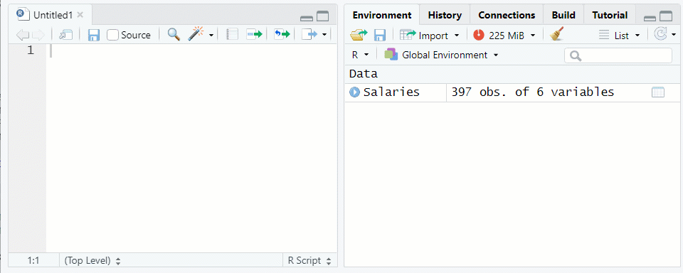
    ```

[Video Tutorial: Data Frames (Viewing)](https://youtu.be/Bl7DWnVDPC0){target="_blank"}

### Indexing and Sequencing

* Indices can be left blank, which selects *all* of that dimension
    ```{r}
    x.df[2, ]   # Obtain all of row 2
    x.df[ ,3]   # Obtain all of column 3
    ```
* As with vectors, indexing can be done with sequencing and negative indices to omit rows
    ```{r}
    x.df[2:3, ]   # Obtain rows 2 and 3
    x.df[ ,-2]    # Exclude column 2
    ```
* Indexing a data frame returns an object, but the object type depends on the indexing
    * Choosing $n$ rows and and a single column yields a vector of length $n$
    * Choosing multiple columns returns a new data frame
    * Use the `str()` function to verify the new objects structure
    ```{r}
    str(x.df[1, 1])   # 1 row and 1 column = vector of length 1
    str(x.df[1:3, 2]) # 3 rows and 1 column = vector of length 3
    str(x.df[1, 1:2]) # 1 row and 2 columns = 1 x 2 data frame
    str(x.df[1:4, c(1, 3)])  #4 rows and 2 columns = 4 x 2 data frame
    ```
* Data frames can also be indexed using column names after the `$` character
    ```{r}
    x.df$x.Char
    ```

[Video Tutorial: Data Frames (Indexing & Sequencing)](https://youtu.be/ie3CmeEule8){target="_blank"}

\newpage
## Data Transformations

* Analysts and researchers often need to create new variables from existing ones or transform existing variables
* Data transformations can usually be accomplished in more than one way
    * Using base R will be shown first
    * After the `dplyr` package is introduced, a second way will be shown
* For the transformations shown below, either a new variable will be added to the data frame, or an existing variable will be changed
    * However, it is not always required that the data frame be changed
        * Sometimes, a transformation will be done 'on the fly' and used only in an analysis, but the data frame remains the same

### Creating New Variables

* Adding a new variable is done using code such as `df$new <- SOME FUNCTION`, where:
    * `df` is the name of the data frame
    * `new` is the name for the new variable 
    * `SOME FUNCTION` is the data transformation to take place
    ```{r}
    # Create new variable 'NumSq' that is the square of current variable x.Num
    x.df$NumSq <- x.df$x.Num^2
    x.df
    ```

[Video Tutorial: Data Transformations (Introduction)](https://youtu.be/KixEf4zV6C8){target="_blank"}

### Recoding (Create New)

* In base R, recoding is usually a multi-step process using indexing
    ```{r}
    # Recode 'x.Num' into three factors
    x.df$Grp <- "low"   # Create new variable and set all rows to one level
    x.df$Grp[x.df$x.Num>=3 & x.df$x.Num<10] <- "med"   # Create medium level
    x.df$Grp[x.df$x.Num>10] <- "high"   # Create high level
    x.df$Grp <- as.factor(x.df$Grp)   # Set new variable as factor
    str(x.df)   # See structure of data frame with new variable
    ```
    Notice the `&` in the code above. It stands for "and", which tells R that both conditions must be true

[Video Tutorial: Data Transformations (Recoding New Variables)](https://youtu.be/enpF3a-dc4c){target="_blank"}
[Video Tutorial: Data Transformations (Factor Variables)](https://youtu.be/UVoPF54_TYk){target="_blank"}
    
### Recoding (Change Existing) 

* Recoding to change an existing variable is done in a similar manner
    * **NOTE**: Sometimes we have to first change the variable type, such as when the existing variable is a factor
    ```{r}
    # Recode 'Grp' into only two factors
    # Change type to 'character'
    x.df$Grp <- as.character(x.df$Grp)
    # Recode 'low' and 'med' to 'very low'
    x.df$Grp[x.df$Grp=="low" | x.df$Grp=="med"] <- "very low"
    # Change back to factor
    x.df$Grp <- as.factor(x.df$Grp)
    str(x.df)
    ```
    Notice the `|` in the code above. It stands for "or", which tells R that either condition can be true.

[Video Tutorial: Data Transformations (Recoding Existing Variables)](https://youtu.be/2DwC2RzL6cY){target="_blank"}

\newpage    
## R Projects

The best way to manage all of the downloads and assignments for this course is to create an R Project. Follow the following steps to create a new R Project.

1. From within RStudio, select <u>F</u>ile&#8594;New <u>P</u>roject...<br>See Figure \@ref(fig:newproj1)<br>If a *Save Current Workspace* window pops up, select *Don't Save*
    ```{r newproj1, echo=FALSE, fig.cap="Starting a New R Project"}
    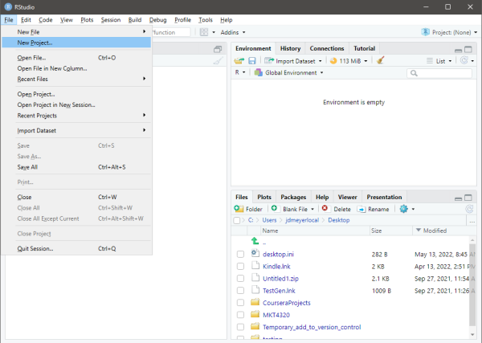
    ```
2. To create the project in a new directory, select *New Directory* in the *New Project Wizard* window, then select *New Project*. Next, type in the name of the directory in the *Directory Name:* box (See **1** in Figure \@ref(fig:newproj2)). Next, use the *Browse* button to select the location of the new directory (See **2** in Figure \@ref(fig:newproj2)). Finally, click on *Create Project* to create the project (See **3** in Figure \@ref(fig:newproj2)).
    ```{r newproj2, echo=FALSE, fig.cap="Creating New R Project in New Directory"}
    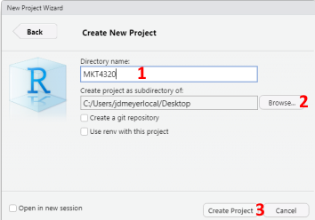
    ```
3. To create the project in an existing directory, select *Existing Directory* in the *New Project Wizard* window. Next, use the *Browse* button to select the location of the existing directory (See **1** in Figure \@ref(fig:newproj3)). Finally, click on *Create Project* to create the project (See **2** in Figure \@ref(fig:newproj3)).
    ```{r newproj3, echo=FALSE, fig.cap="Creating New R Project in Existing Directory"}
    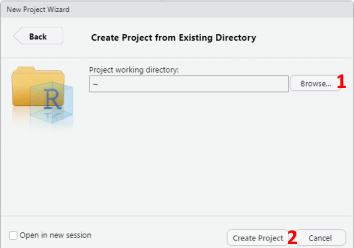
    ```

To use the new project each time you work in RStudio for this class, you will need to open the project by using the drop down project menu (See **1** in Figure \@ref(fig:newproj4)) and then selecting the appropriate project (See **2** in Figure \@ref(fig:newproj4)).
```{r newproj4, echo=FALSE, fig.cap="Opening an R Project"}
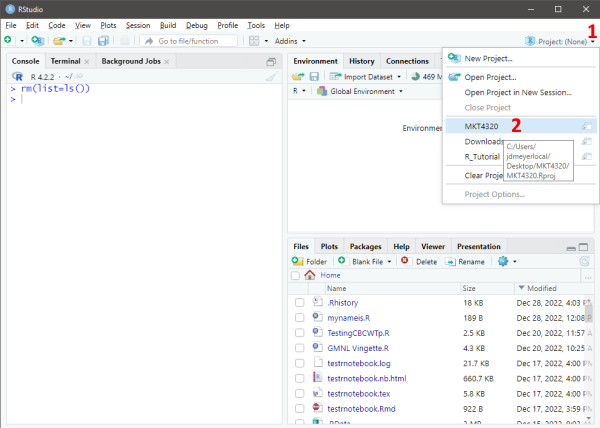
```

[Video Tutorial: R Projects using New Directory Option](https://youtu.be/bnElDlMXnAU){target="_blank"}

\newpage    
## Loading and Saving Data

In this class, the data will be provided to you as an `.Rdata` file, which are specific to R and the best way to store (and load) objects. If desired, `.Rdata` files can contain multiple objects. For example, an `.Rdata` file could contain two different data frames.

### Setting Working Directory

To know where your files are saved to, and to make it easier to load files, it is best to use the R Project discussed above. However, you can also just place all of your files for the course in the same working directory.

* Use the `getwd()` function to see your current working directory
```{r echo=FALSE}
knitr::opts_knit$set(root.dir = "C:/Users/jdmeyer/Docs/RFiles")
```

    ```{r}
    getwd()
    ```
    
```{r echo=FALSE}
knitr::opts_knit$set(root.dir = "C:/Users/jdmeyer/Dropbox/_DATA/Teaching/MKT4320/R_Tutorial")
```

* Set the working directory in one of three ways:
    1. Use the `setwd()` function:<br>
    `setwd("C:/Users/jdmeyer/Doc/RFiles/RTutorial")`<br>
    **NOTE**: Forward slashes (as shown above) are used in place of backward slashes for directory paths
    2. Use the menus in RStudio<br>
    <u>S</u>ession&#8594;Set <u>W</u>orking Directory&#8594;<u>C</u>hoose Directory<br>
    See Figure \@ref(fig:setwd1)
    ```{r setwd1, echo=FALSE, fig.cap="Set Working Direcory using Menus"}
    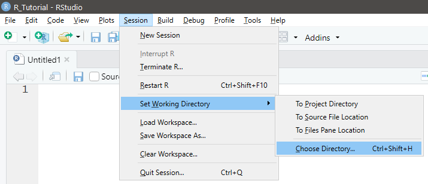
    ```
    3. Use the `Files` tab in the lower-right corner in RStudio<br>
    See Figure \@ref(fig:setwd2)
    ```{r setwd2, echo=FALSE, fig.cap="Set Working Direcory using Files Tab"}
    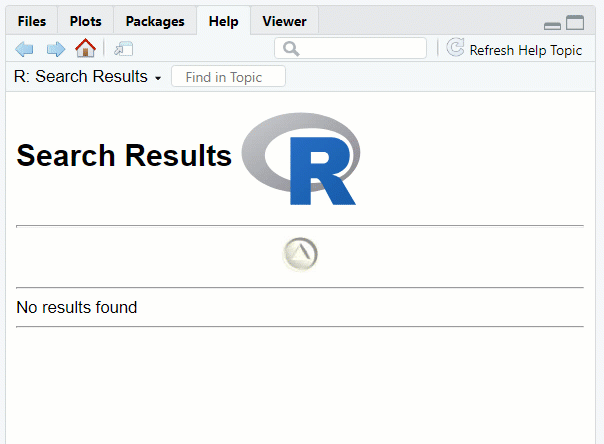
    ```
    
### Loading .Rdata

* Use the `load("FILE LOCATION/NAME")` function to load and `.Rdata` file
    * Suppose the data set used in Topic 1 (<span style="font-family: Courier;">airlinesat.rdata</span>) is in a subdirectory of the working directory called <span style="font-family: Courier;">Data</span>
    ```{r}
    load("Data/airlinesat.rdata")
    ```
    See \@ref(fig:loaddata) for a visual example
    ```{r loaddata, echo=FALSE, fig.cap="Loading Data"}
    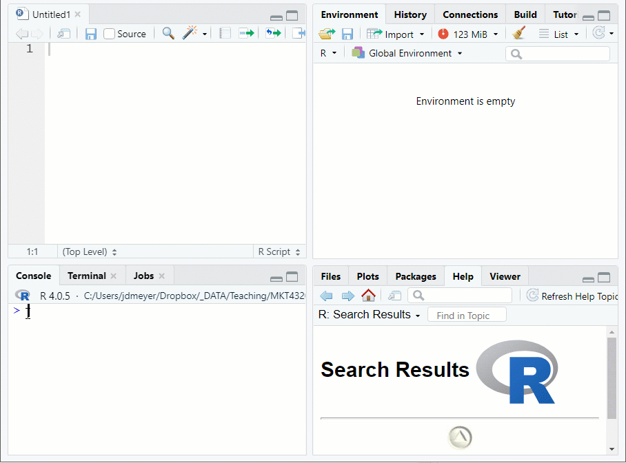
    ``` 

### Saving .Rdata

* Use the `save(OBJECT, file="SAVENAME")` function, where:
    * <span style="font-family: Courier;">OBJECT</span> is one or more objects in the current environment separated by commas
    * <span style="font-family: Courier;">SAVENAME</span> is the name of the file the objects will be saved to.
    ```{r eval=FALSE}
    save(x.df, file="xdf.rdata")
    ```

\newpage
## User Defined Functions

Often, a series of commands is repeated over and over, or there is not an easy, built-in function in R to provide a needed result.  In these case, R makes it relatively easy to create your own functions

### Structure

* A function is constructed in the in the following manner:<br>
`function.name <- function(arglist) {body}` where
    * `function.name` is the name of the user defined function
    * `(arglist)` contains the names of any inputs to the function, separated by commas
    * `{body}` contains the code that operates on the inputs
* The function must be executed prior to using it in the current session; alternatively, the function can be saved as a ".R" script file and sourced using the `source()` function in R

### Example

* Suppose a function is need to take the square root of a natural log transformation
* The new function will be named `sqlog` and will have one argument
    ``` {r t1function1}
    # Define the new function
    sqlog <- function(x) {   # Function has one argument, 'x'
        sqrt(log(x))   # What is done with the argument, 'x'
    }
    ```
* Now that the function is created and ran, it can be used.  In this case, the output will be printed to the console. The function could have been written in a way that the result is stored as an object.
    ``` {r t1function2, cache=TRUE}
    sqlog(100)   # Using the function on a single number
    myvals <- c(5, 10, 20, 40, 80, 160)  # Creating a vector of values
    sqlog(myvals)   # Using the function on a vector
    ```

\newpage
## Package *MKT4320BGSU*

The `MKT4320BGSU` package is a package I created that contains data sets and user-defined functions for this course. By installing this package when instructed, you will more easily be able to access the functions and data for the course, and you will have access to help files for the functions and data sets.  The process for installing this package is a little different. You must first install the `devtools` package in order to use the `install_github` command.  The steps are shown in the code below.

``` {r mkt4320pack, eval=FALSE}
# INSTALL 'devtools'
# NOTE: This step only has to be done the first time
install.packages("devtools")

# LOAD 'devtools' package
library(devtools)

# INSTALL 'MKT4320BGSU' package
install_github("jdmeyer73/MKT4320BGSU")

# LOAD 'MKT4320BGSU' package
library(MKT4320BGSU)
```

\newpage
## Package *dplyr*

The `dplyr` package (pronounced DEE ply er) is a package that makes data manipulation much easier and more intuitive (for most).  `dplyr` is built around the five main "verbs" shown below that make up a majority of data manipulation. However, there are other functions that `dplyr` uses to also help with data manipulation.

* `select` is used to subset columns
* `filter` is used to subset rows
* `arrange` is used to sort rows
* `mutate` is used to add new columns based on calculations (usually with other columns)
* `summarise` is use to perform summary calculations (e.g., mean, max, etc.) on data set

In addition, `dplyr` uses the pipe, `%>%`, to string together a series of functions. Think of functions strung together as upstream and downstream functions.  The function to the left of `%>%` is the upstream function, while the function to the right is the downstream function.

* By default, the downstream function assumes the value coming from the upstream function is the first argument in its function
    * Therefore, the first argument can be omitted
* If the downstream function needs to use the value from from the upstream function assigned to a different argument, a `.` is simply put in the position of that argument

### *dplyr* Examples

First, be sure the `dplyr` package is loaded:
```{r, message=FALSE}
library(dplyr)
```

We'll be using the airlinesat dataset from the [airlinesat.rdata](Data/airlinesat.rdata) file for these examples. 

[Video Tutorial: dplyr (Introduction)](https://youtu.be/dGX-ucjKAKI){target="_blank"}

#### `select()` function

* Usage: `select(.data, ...)`, where `...` is one or more unquoted expressions separated by commas
* `airlinesat` has 70 variables, but 46 of them are a series of expectation (<span style="font-family: Courier;">e1</span> to <span style="font-family: Courier;">e23</span>) and satisfaction (<span style="font-family: Courier;">s1</span> to <span style="font-family: Courier;">s23</span>)scales.
    * First, we want to create a new data frame with those variables excluded.
        * For simplicity, the `num_range("prefix", start:finish)` selection can be used, and the `!` takes the complement (i.e., all but these)
    ```{r}
    airlinesat.small <-     # Create new data frame
        airlinesat %>%      # Use airlinesat as the starting data frame
        select(!num_range("e", 1:23)) %>%  # Select all but e1 to e23        
        select(!num_range("s", 1:23))   # Select all but s1 to s23
    # NOTE: the two selects could have been concantendated as:
    # select(!c(num_range("e", 1:23), num_range("s", 1:23)))
    str(airlinesat.small)
    ```
    * Second, we want to create a new data frame with only demographic variables
    ```{r}
    airlinesat.d <-    # Create new data frame
        airlinesat %>%     # Use airlinesat as the starting data frame
        select(age, country, gender)    # Select only demographic variables
    str(airlinesat.d)
    ```

[Video Tutorial: dplyr::select()](https://youtu.be/lx3MMLlqKL0){target="_blank"}

#### `filter()` function

* Usage: `filter(.data, ...)`, where `...` is an expression that returns a logical value
* First, we want to select only those rows where the person is from the United States (i.e., `country == "us"`) using the newly created `airlinesat.d` data frame 
    ```{r}
    airlinesat.dus <- airlinesat.d %>%
        filter(country == "us")
    head(airlinesat.dus)
    ```
* Second, we want to select only those rows where the person is older than the mean age using the newly created `airlinesat.d` data frame
    ```{r}
    airlinesat.dold <- airlinesat.d %>%
        filter(age > mean(age, na.rm=TRUE))
    head(airlinesat.dold)
    ```

[Video Tutorial: dplyr::filter()](https://youtu.be/tkbtTjqPaA0){target="_blank"}
    
#### `arrange()` function

* Usage: `arrange(.data, ..., .by_group = FALSE)` where `...` are variable(s) or functions of variables
    * Use `desc(...)` to sort in a descending order
    * `.by_group = TRUE` will sort first by a grouping variable, if one exists; default is `FALSE`
* First, we want to see the first 10 rows in ascending order of age using the `airlinesat.d` data frame
    ```{r}
    # NOTE: A new data frame does not need to be created.
    # The result of the data manipulation can be sent directly
    # to another function, like 'head()'
    airlinesat.d %>%
        arrange(age) %>%
        head(10)
    ```
* Second, we want to see the first 10 rows of three variables (<span style="font-family: Courier;">age</span>, <span style="font-family: Courier;">country</span>, <span style="font-family: Courier;">nflights</span>) from the original `airlinesat` data frame, sorted first ascending by <span style="font-family: Courier;">age</span> and second descending by <span style="font-family: Courier;">nflights</span>
    ```{r}
    airlinesat %>%
        select(age, country, nflights) %>%
        arrange(age, desc(nflights)) %>%
        head(10)
    ```

[Video Tutorial: dplyr::arrange()](https://youtu.be/KKPJaF982tg){target="_blank"}

#### `mutate()` function

* Usage: `mutate(.data, ...)` where `...` are name-value pairs.  The name gives the name of the new column/variable. The value is some function or formula.
* First, we want to create a standard normal variable for age using the airlinesat.d data frame
    ```{r}
    airlinesat.d %>%
        mutate(age_snrm=(age-mean(age, na.rm=TRUE))/sd(age,na.rm=TRUE)) %>%
        head(10)
    ```
* Second, we want to use `mutate` with `recode` to create a new variable, <span style="font-family: Courier;">continent</span> based on variable <span style="font-family: Courier;">country</span>
    * `recode(.x, ...)` where `.x` is the variable to modify and `...` are the things to recode in `old = "new"` format separated by commas
    * Use `recode_factor(.x, ...)` to recode factor variables
    ```{r}
    airlinesat.d %>%
        mutate(continent=recode_factor(country,
                                       at="Europe", ch="Europe", de="Europe",
                                       fr="Europe", us="North America")) %>%
        head(10)
    ```

[Video Tutorial: dplyr::mutate()](https://youtu.be/fx3LMBwLd00){target="_blank"}
    
#### `summarise()` function

* Usage: `summarise(.data, ...)` where `...` are name-value pairs of summary functions (e.g., `mean()`, `min()`, `sum()`, `n()`)
    * More than one summary function can be included
* First, we want to find the mean, standard deviation, and number of valid observations for the <span style="font-family: Courier;">nflights</span> variable
    ```{r}
    airlinesat %>% 
        summarise(mean_flights=mean(nflights, na.rm=TRUE),
                  sd_flights=mean(nflights, na.rm=TRUE), 
                  valid_n=sum(!is.na(nflights)))
    ```
* Second, we want to find the same information as above, but by continent group
    * Use the `group_by()` function before `summarise()`
    ```{r}
    # NOTE: The output will be of type 'tibble' instead of 'data.frame'
    # Tibbles are like data frames, but occasionally behave differently
    
    airlinesat %>% 
        mutate(continent=recode_factor(country,
                                       at="Europe", ch="Europe", de="Europe",
                                       fr="Europe", us="North America")) %>%
        group_by(continent) %>%
        summarise(mean_flights=mean(nflights, na.rm=TRUE),
                  sd_flights=mean(nflights, na.rm=TRUE), 
                  valid_n=sum(!is.na(nflights)))
    ```

[Video Tutorial: dplyr::summarise() and dplyr::group_by()](https://youtu.be/0T5F8fpJI6E){target="_blank"}

\newpage
## Package *lubridate*

The `lubridate` package was created to make working with dates and times a little bit easier.  While the package has a great deal of funcationality, this tutorial will only focus on a some of the most common elements.

Probably the most useful capability of `lubridate` is its ability to quickly parse out parts of a text date string, no matter the form of that string. Fast parsing is done through a series of functions that are based on the order of the parts of date/time in the text string.

* Use `ymd()` if the order is year, month, day, such as "20101215" or "16/7/1"
* Use `mdy()` if the order is month, day, year, such as "January 25, 2016" or "5/29/1993"
* Use `dmy()` if the order is day, month, year, such as "171210" or "5 January 1990"

The results will be the in the format "YYYY-MM-DD" and have a 'Date' class
```{r lubridate, message=FALSE}
library(lubridate)
ymd(c("20101215", "16/7/1"))
mdy(c("January 25, 2016", "5/29/1993"))
dmy(c("171210", "5 January 1990"))
```
If time is also included in the text string, that can also be parsed out, such as `ymd_hms()` where `hms` stands for hours, minutes, seconds

Additionally, lubridate can easily pull out the specific components that are have class 'Date'

* `year(x)` returns the year number
* `month(x)` returns the number of the month
* `month(x, label=TRUE)` returns the month name (abbreviated)
* `day(x)` (or `mday(x)`) returns the number of the day of the month
* `wday(x)` returns the number of the day in week, where Sunday = 1
* `wday(x, label=TRUE)` returns the day of the week name (abbreviated)
* `yday(x)` returns the number of the day of the year
    ```{r lubridate2, cache=TRUE}
    # Use lubridate to create a date class object for my birthday (not really)
    mybday <- mdy("March 15, 1973")
    year(mybday)
    month(mybday)
    month(mybday, label=TRUE)
    day(mybday)
    wday(mybday)
    wday(mybday, label=TRUE)
    yday(mybday)
    ```

\newpage    
## R Markdown and R Notebook

R Markdown allows users to create documents that combine code and text.  Ultimately, they are used for "reproducible research".  That is, the R Markdown files allow other people to see exactly what was done, and if the data is available to all, other people can reproduce the research.

In this class, R Notebooks, which use R Markdown, will be used for the lab assignments. You will write your code in the R Notebook file, and answer the assignment questions with the code your have written.

While R Markdown has a great deal of functionality, we will focus on a select few of those features.  This [cheatsheet](https://raw.githubusercontent.com/rstudio/cheatsheets/main/rmarkdown.pdf) may be beneficial.

### YAML Header

The top of every R Markdown is a section called the YAML header, which is enclosed at the top and bottom with `---`. For this class, the only thing in the YAML header that you will need to change is the `author:` section.

``` {r yamlheader, echo=FALSE, fig.cap="Change Author in YAML Header"}
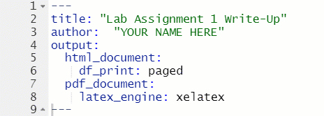
```

### Markdown Syntax

When writing text in R Markdown, there isn't a "point and click" menu to change fonts size or to add italics or bold text or to insert an equation. Instead, it requires the use of "markdown" syntax.  The most commonly used are provided below:

---

```
Plain text
```
Plain text

---

```
*Italic*
```
*Italic*

---

```
**Bold**
```
**Bold**

---

```
***Bold and Italic***
```
***Bold and Italic***

---

```
# Header 1
```
<p style="font-size: 34px;">Header 1</p>

---

```
## Header 2
```
<p style="font-size: 28px;">Header 2</p>

---

```
### Header 3
```
<p style="font-size: 22px;">Header 3</p>

---

```
#### Header 4
```
<p style="font-size: 18px;">Header 4</p>

---

```
* Unordered list item
* Item 2
    * Item 2a (indent 4 spaces)
    * Item 2b
```
* Unordered list item
* Item 2
    * Item 2a (indent 4 spaces)
    * Item 2b
    
---

```
1. Ordered list item
2. Item 2
    1. Item 2a (indent 4 spaces)
    2. Item 2b
```
1. Ordered list item
2. Item 2
    1. Item 2a (indent 4 spaces)
    2. Item 2b

---

```
`verbatim code`
```
`vertabim code`

---

```
equation: $y=\alpha+\betax$
```
equation: $y=\alpha+\beta x$

(See [this file](https://www.caam.rice.edu/~heinken/latex/symbols.pdf) for symbols)

### Code Chunks

One of the greatest things about R Markdown and R Notebook files is the ability to include code, and run the code, within the file. Putting code in the file is done with code chunks.

#### Inserting a Code Chunk

Code chunks can be inserted by clicking on the "Insert Chunk" button in the document toolbar (see Figure \@ref(fig:insertcodechunk)) or by manually typing in the code chunk (see Figure \@ref(fig:typecodechunk))

``` {r insertcodechunk, echo=FALSE, fig.cap="Inserting a Code Chunk from the Toolbar"}
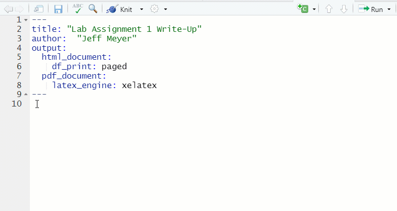
```

``` {r typecodechunk, echo=FALSE, fig.cap="Inserting a Code Chunk Manually"}
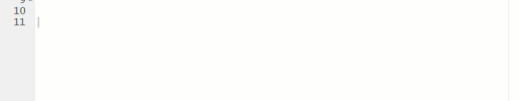
```

#### Using Code Chunks

* R Markdown and R Notebook don't pay attention to anything else going on in your R/RStudio session
    * Any objects, data, packages, or user defined scripts must be in a code chunk
    * However, once they are loaded in a chunk, they do not need to be loaded again in subsequent chunks
* To run a code chunk, click on the green triangle (
    * If you run a chunk that does have the necessary object, data, etc., you will get an error message (see Figure \@ref(fig:chunkerror))
    ``` {r chunkerror, echo=FALSE, fig.cap="Chunk Error"}
    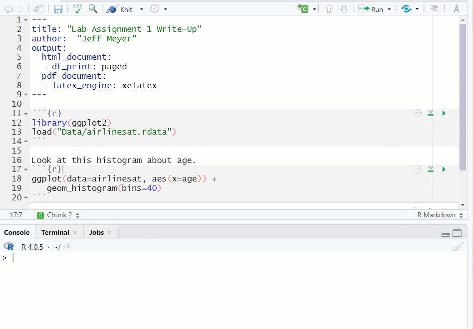
    ```
    * If you need to run previous chunks to load data or packages, click on the gray triangle with the green bar underneath () first, then click on the green triangle (see Figure \@ref(fig:runchunk))
    ``` {r runchunk, echo=FALSE, fig.cap="Run Previous Chunks, then Run Chunk"}
    knitr::include_graphics("Images/RunChunks.gif")
    ```
* Once the chunk runs correctly, the result will be shown under the chunk
    * To clear the result, click on the 'x' in the upper right hand corner of the results

#### "Knitting" the Results

At any time, you can "Knit" the R Notebook file to an HTML document or a PDF document. While working through the document, HTML is usually quicker. When the document is completed, a PDF is more professional looking.

* To "Knit" the file, click on the down arrow next to "Knit" in the document toolbar, and select how you would like to product the document (see Figure \@ref(fig:knitto))
    * By default, a document knitted to HTML will be viewable in the "Viewer" window in the lower right hand side of RStudio.
    * For documents knitted to PDF, RStudio generally opens up a new window with the knitted PDF, from which the file can be saved to a local directory
    ``` {r knitto, echo=FALSE, fig.cap="Knit a Document"}
    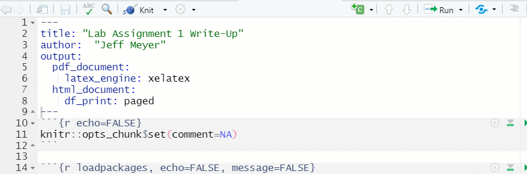
    ```

\newpage    
## Working with R Notebook Lab Assignment Files

The best way to show how to use the R Notebook files for the Lab Assignments is through video demonstrations.  The five video files below will show how to work the files.

[Video Tutorial: Downloading and Opening the File](https://youtu.be/VEYYWjCnHuU){target="_blank"}  

[Video Tutorial: The YAML Header](https://youtu.be/-f-dCBLXL60){target="_blank"}  

[Video Tutorial: Code and Answers (Part 1)](https://youtu.be/EvC2NTT3UyU){target="_blank"}  

[Video Tutorial: Code and Answers (Part 2)](https://youtu.be/liB6OP9dv3U){target="_blank"}  

[Video Tutorial: Saving Files and Recognizing Errors](https://youtu.be/HDQqA8g7DcY){target="_blank"}  
